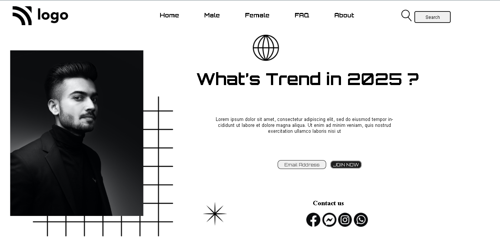

# Assignment-1

# Project [Deployed Link]("https://deepakproject01.netlify.app")

- What I learned from this Project?
  - 
  - Learned how to use HTML and CSS to create a beutiful website.
  - Learnd to use css position property.
  - Learned about z indexing to stack elements on top of each other.

 
---

## Time taken to finish this project

- 5 hour to complete it.

---

## ScreenShot

